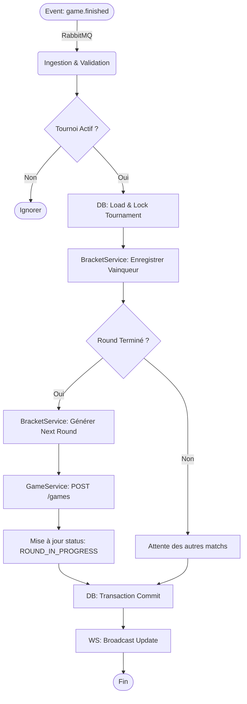

# Architecture Technique : Orchestration et Gestion d'État

### 1. Principes d'Architecture

* **Pattern :** Architecture en couches (N-Tier) avec Injection de Dépendances via `my-fastify-decorators`.
* **Concept Central : Machine à États (State Machine).**
* Le service n'est pas seulement réactif ; il possède une logique interne qui fait avancer l'état d'un tournoi (ex: `PENDING` -> `IN_PROGRESS` -> `FINISHED`).


* **Découplage :** Séparation stricte entre la *Logique de Tournoi* (qui joue contre qui) et l'*Exécution du Jeu* (qui gagne le point).
* **Abstraction des Participants :** Le cœur logique du tournoi manipule des entités `Participant` génériques, agnostiques de la méthode d'authentification (Guest ou User), déléguant la résolution d'identité aux couches supérieures (Guards/Gateways).

### 2. Organisation Modulaire

Découpage du code source pour isoler les responsabilités.

* **AppModule :** Point d'entrée de l'application, configuration globale et enregistrement des plugins Fastify.

* **ParticipantModule :**
* Responsable de l'identité hybride (Guest vs User).
* Fournit le `ParticipantService` pour normaliser les joueurs et valider les alias invités.
* Gère la sécurité liée aux participants (limites, validation).

* **TournamentModule :**
* Module principal contenant la logique métier (Business Logic) et la Machine à États.
* Gère le cycle de vie (Lobby, Start, In-Progress, Finished).
* Expose les API REST et le Gateway WebSocket pour le temps réel.

* **BracketModule (Moteur d'Arbre) :**
* Module "Mathématique" pur et sans état (Stateless).
* Contient les algorithmes de génération des arbres, le seeding (mélange), et la logique de progression.
* Totalement découplé de la base de données.

* **HistoryModule :**
* Gestion de l'archivage et de la consultation des tournois terminés (Read-Only access optimisé).

* **InfrastructureModule :**
* Couche d'abstraction technique.
* Gère les clients externes (HTTP vers GameService), les connecteurs de base de données (SQLite), et le bus d'événements (RabbitMQ).


### 3. Composants Clés et Rôles

* **TournamentController (`@Controller`) :**
* **Rôle :** Interface d'entrée pour les commandes synchrones (HTTP).
* **Responsabilités :** 
    * Réception des requêtes de création, d'inscription et de lancement.
    * Validation stricte des données entrantes via DTOs (`my-class-validator`).
    * Délègue l'exécution métier au `TournamentService` et renvoie les codes HTTP appropriés (201 Created, 400 Bad Request, etc.).


* **TournamentGateway (`@WebSocketGateway`) :**
* **Rôle :** Interface de communication temps réel bidirectionnelle.
* **Responsabilités :**
    * Gestion des connexions persistantes (Socket.IO) et des "Rooms" par tournoi.
    * **Broadcast d'état :** Pousse la mise à jour de l'arbre (Bracket) à tous les clients connectés dès qu'un changement survient.
    * **Lobby en direct :** Notifie l'arrivée de nouveaux participants aux joueurs en attente.


* **TournamentService (`@Service`) :**
* **Rôle :** Orchestrateur central et garant de la Machine à États.
* **Responsabilités :**
    * **State Management :** Vérifie les transitions autorisées (ex: impossible de `join` si état `STARTED`).
    * **Coordination :** Appelle le `BracketService` pour la logique algorithmique, puis le `Repository` pour la sauvegarde.
    * **Interactions Externes :** Communique avec le service Game pour commander la création des matchs.


* **BracketService (ex-BracketEngine) :**
* **Rôle :** Moteur algorithmique pur (Pure Logic).
* **Responsabilités :**
    * Ne contient **aucun état** et ne fait **aucun appel DB/Réseau**.
    * Prend en entrée une structure de tournoi et une action (ex: "Match 3 gagné par A"), retourne la nouvelle structure calculée.
    * Gère la complexité des arbres binaires parfaits (4, 8, 16 joueurs) et de la progression.


* **TournamentRepository :**
* **Rôle :** Couche d'accès aux données (Persistence Layer).
* **Responsabilités :**
    * **Abstraction SQL :** Masque la complexité des requêtes SQLite.
    * **Sérialisation JSON :** Convertit l'objet complexe du tournoi (graphe de matchs) en format stockable pour la DB.
    * **Intégrité :** Utilise des transactions pour garantir que l'état du tournoi reste cohérent même en cas d'erreur ou de concurrence.


### 4. Le Workflow de Traitement (The Processing Loop)

Ce workflow décrit la réaction du service à la fin d'un match. C'est le cœur réactif du système.



#### Détail des Étapes

1.  **Ingestion (Event Driven) :**
    *   Le `InfrastructureModule` consomme le message `game.finished` depuis RabbitMQ.
    *   Payload typique : `{ gameId, winnerId, score }`.
    *   *Sécurité :* Validation que le `gameId` correspond bien à un match en cours dans le tournoi référencé.

2.  **Hydratation et Verrouillage (Concurrence) :**
    *   Chargement de l'agrégat `Tournament` complet depuis SQLite.
    *   **Point Critique :** Utilisation d'une transaction ou d'un verrou optimiste (versioning) pour éviter les "Race Conditions" si deux matchs finissent exactement au même moment.

3.  **Logique Métier (Pure) :**
    *   Appel au `BracketService` (Stateless) :
        *   `advanceWinner(currentTree, gameId, winnerId)`
    *   Le service met à jour le nœud correspondant dans l'arbre JSON en mémoire.

4.  **Décision de Transition :**
    *   Le `TournamentService` demande : `isRoundComplete(newTree) ?`
    *   **Cas A (Non) :** On sauvegarde juste le résultat. Le tournoi reste dans l'état actuel.
    *   **Cas B (Oui) :**
        1.  Génération des paires du tour suivant (`generateNextRound`).
        2.  Appel API synchrone vers le **Game Service** pour créer les nouvelles instances de jeu (pré-réservation).
        3.  Transition d'état du tournoi (ex: `ROUND_1` -> `ROUND_2`).

5.  **Persistance Atomique :**
    *   Sauvegarde du nouvel état (JSON de l'arbre + Statut) en base de données via `TournamentRepository`.

6.  **Broadcast Temps Réel :**
    *   Emission de l'événement `tournament_update` via le `TournamentGateway`.
    *   Les clients (WebSockets) reçoivent le nouvel arbre et rafraîchissent l'affichage visuel.
    *   Si un nouveau match est prêt, les joueurs concernés reçoivent une notification spécifique `match_ready`.

### 5. Modèle de Données et Sérialisation

* **Stockage JSON (Pattern : Document Store in SQL) :**
    * **Choix Technique :** L'arbre de tournoi est une structure de données récursive complexe (graphe de matchs) difficile à mapper proprement en tables relationnelles classiques sans jointures coûteuses.
    * **Implémentation :** Une colonne `bracket_data` de type `TEXT` (ou `JSONB` si supporté) stocke l'état complet.
    * **Exemple de structure stockée :**
      ```json
      {
        "rounds": [
          { "id": 1, "matches": [{ "p1": "A", "p2": "B", "winner": null }] }
        ],
        "currentRound": 1
      }
      ```
    * **Avantage :** Chargement/Sauvegarde en une seule requête (Atomicité) et mapping direct vers les objets TypeScript en mémoire.

* **DTOs (Data Transfer Objects) :**
    * **Séparation Interne/Externe :** Le modèle de base de données n'est jamais exposé directement.
    * **TournamentResponseDto :** Format optimisé pour le rendu frontend (ex: `react-tournament-bracket`).
    * **Enrichissement :** Le DTO peut inclure des champs calculés à la volée (ex: `isJoinable`, `playerCount`) et masquer des données techniques (ex: `rabbitMQMessageId`).
    * **Validation :** Les DTOs d'entrée (`CreateTournamentDto`) utilisent `my-class-validator` pour garantir l'intégrité avant même d'atteindre la logique métier.


### 6. Gestion des Pannes et Reprise (Recovery Strategy)

L'architecture étant "Stateful" (le tournoi a un état actif qui évolue), la résilience est critique. Si le serveur redémarre, le tournoi doit reprendre exactement là où il s'est arrêté.

#### Processus de Démarrage (Boot Sequence)

1.  **Scan des Tournois Actifs :**
    *   Au lancement, le `TournamentModule` interroge la base de données pour tous les tournois ayant le statut `IN_PROGRESS` ou `STARTING`.

2.  **Réconciliation d'État (State Reconciliation) :**
    *   Pour chaque tournoi actif, le système inspecte le *Round* actuel.
    *   Il identifie les matchs marqués comme "En cours" (pas de vainqueur encore enregistré).
    *   **Action Corrective :** Il interroge l'API du **Game Service** (`GET /games/:id`) pour chaque match en suspens.
        *   *Cas 1 (Match terminé pendant la coupure) :* Le service récupère le résultat et déclenche manuellement la logique `advanceWinner`.
        *   *Cas 2 (Match toujours en cours) :* Aucune action, on attend l'événement RabbitMQ standard.
        *   *Cas 3 (Match disparu/crashé) :* Le service peut décider de relancer le match ou de déclarer un forfait technique (selon la politique configurée).

3.  **Restauration des Écoutes :**
    *   Vérification que la connexion RabbitMQ est saine et que la queue d'événements est purgée des messages accumulés pendant le downtime.

4.  **Notification Client :**
    *   Dès que les clients WebSocket se reconnectent, ils reçoivent l'état "frais" et consolidé, masquant totalement l'interruption de service.