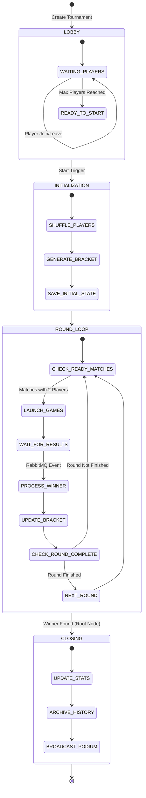

# Machine à États et Workflows du Tournoi

### 1. Vue d'Ensemble de la Machine à États

Cette section définit les statuts possibles d'un tournoi. Le service agit comme une *Finite State Machine* (FSM).

*   **Liste des États (Status Enum) :**
    *   `PENDING` : Le lobby est ouvert, les joueurs s'inscrivent.
    *   `IN_PROGRESS` : Le tournoi est lancé, le bracket est généré, les matchs se jouent.
    *   `FINISHED` : Le vainqueur final est connu.
    *   `CANCELLED` : Annulé par l'admin ou par manque de joueurs.


### 2. Workflow Détaillé : Phase par Phase

Ce workflow couvre le cycle de vie complet d'un tournoi, de la création à l'archivage.



#### 2.1 Phase d'Inscription (Lobby)
*   **État :** `PENDING`
*   **Action :** Les joueurs s'inscrivent au tournoi.
    *   **Via REST (`POST /join`) :** Méthode privilégiée pour l'inscription formelle. Elle garantit une réponse atomique (Succès ou Erreur avec raison précise) et l'enregistrement en base.
    *   **Via WebSocket :** Utilisé ensuite pour rejoindre la "Room" temps réel, voir les autres arrivants et recevoir le signal de départ.
*   **Contrôles Métier :**
    *   **Unicité :** Vérification stricte des doublons (Alias pour les invités, UserID pour les inscrits).
    *   **Limites :** Le lobby refuse toute entrée une fois la capacité (4, 8, 16) atteinte.
*   **Temps Réel :** Le Gateway envoie un événement `lobby_update` à chaque changement pour que le front mette à jour la liste des avatars.

#### 2.2 Phase d'Initialisation (Le "Shuffle")
*   **Transition :** `PENDING` -> `IN_PROGRESS`
*   **Condition Préalable (Hard Constraint) :** Quel que soit le mode de démarrage, un **minimum de 4 participants** est requis. Si le timer expire avec moins de 4 joueurs, le tournoi est annulé ou reporté (selon config).
*   **Trigger (Configurable à la création) :**
    *   **Manuel :** Le créateur clique sur "Start" (bouton désactivé si < 4 joueurs).
    *   **Auto-Full :** Démarrage immédiat dès que le lobby est plein (ex: 4, 8 ou 16 joueurs).
    *   **Auto-Timer :** Tentative de démarrage à l'heure cible. Si la condition de 4 joueurs n'est pas remplie, le tournoi est **automatiquement annulé** (`CANCELED`).
*   **Algorithme (Synchronisation) :**
    1.  **Verrouillage :** Le lobby est clos, plus personne ne peut rejoindre/quitter.
    2.  **Shuffle :** Mélange aléatoire cryptographiquement sûr des participants pour éviter les arrangements.
    3.  **Génération d'Arbre :** Création de la structure binaire JSON. Les joueurs sont placés dans les slots du Round 1.
    4.  **Commit :** Sauvegarde de l'arbre initial en DB.

#### 2.3 La Boucle de Tournoi (Round Loop)
C'est un cycle événementiel perpétuel tant qu'il reste des matchs.

1.  **Détection des Matchs Prêts (Matchmaking Interne) :**
    *   Le système scanne le Round actuel.
    *   Condition : Un match est "Prêt" si `Player1 != null` ET `Player2 != null` ET `Status == PENDING`.

2.  **Lancement des Parties (Game Dispatch) :**
    *   Pour chaque match prêt, le service appelle l'API du Game Service : `POST /games`.
    *   Il reçoit en retour un `gameId`.
    *   Il notifie les deux joueurs concernés via WebSocket : `match_ready { gameId: "..." }`.

3.  **Attente Passive (Wait State) :**
    *   Le tournoi ne consomme aucune ressource CPU. Il attend simplement un événement.

4.  **Traitement des Résultats (Event Driven) :**
    *   Sur réception de `game.finished` (RabbitMQ) :
        *   Le vainqueur est promu au nœud parent dans l'arbre.
        *   Le perdant passe au statut `ELIMINATED`.
        *   L'arbre est sauvegardé.

5.  **Transition de Round :**
    *   Si tous les matchs du Round N sont terminés (tous ont un vainqueur), le système incrémente le compteur de Round.
    *   Le cycle recommence à l'étape 1 pour lancer les matchs du nouveau Round.

#### 2.4 Phase de Clôture
*   **État :** `IN_PROGRESS` -> `FINISHED`
*   **Condition :** Le nœud racine de l'arbre a un vainqueur (Winner).
*   **Actions Finales :**
    1.  **Archivage :** Le tournoi est marqué comme terminé en DB.
    2.  **Statistiques (Mode Authentifié) :** Mise à jour asynchrone des profils utilisateurs ("Tournois gagnés", "Matchs joués").
    3.  **Cérémonie :** Broadcast d'un événement `tournament_end` avec le classement final (Podium) pour affichage d'une vue de célébration sur le front.


### 3. Gestion des Cas Limites (Edge Cases)

La robustesse du tournoi dépend de sa capacité à gérer les imprévus sans bloquer l'ensemble des participants.

#### 3.1 Déconnexions et Abandons

*   **Déconnexion Temporaire (Reconnexion) :**
    *   Le système tolère une déconnexion brève (ex: < 30s).
    *   Si le joueur revient, il récupère sa session WebSocket et, s'il est en match, est redirigé vers l'arène de jeu (le Game Service gère la pause/reprise).

*   **Disqualification pour Absence (No-Show) :**
    *   **Scénario :** Un joueur ne se présente pas à son match dans le délai imparti (ex: 2 minutes après notification `match_ready`).
    *   **Action :** Le `TournamentService` déclare le match forfait.
    *   **Résultat :** L'adversaire gagne par défaut (Walkover). Le joueur absent est marqué `DISQUALIFIED`.

*   **Abandon Volontaire (Surrender) :**
    *   Si un joueur clique sur "Quitter le tournoi" alors qu'il est encore en lice.
    *   Il est immédiatement marqué `ELIMINATED`.
    *   Son adversaire actuel (ou futur) gagne le match par forfait.

#### 3.2 Problèmes Techniques

*   **Crash du Game Service (Lors de la création) :**
    *   Si le `POST /games` échoue (timeout ou 500).
    *   **Retry Policy :** Le service retente 3 fois avec un backoff exponentiel (1s, 2s, 5s).
    *   **Fallback :** Si échec définitif, le tournoi est mis en pause (`PAUSED`) et une alerte admin est levée. Les joueurs sont notifiés "Problème technique, veuillez patienter".

*   **Incohérence de Résultat (Arbitrage) :**
    *   Si le Game Service renvoie un résultat impossible (ex: vainqueur non participant au match).
    *   Le message est rejeté (Dead Letter Queue) et le match reste en état `IN_PROGRESS`. Une intervention manuelle ou un timeout de sécurité (Watchdog) sera nécessaire.

*   **Match Interminable (Zombie Game) :**
    *   Si un match dépasse une durée limite (ex: 15 minutes pour un Pong).
    *   Un Job Watchdog vérifie périodiquement les matchs en cours.
    *   Il interroge le Game Service pour savoir si la partie est active. Si elle est morte, il force une fin de match (soit annulation, soit tirage au sort, selon règles).


### 4. Structure de Données de l'État (State Payload)

Voici un exemple complet de l'objet JSON stocké en base (`bracket_data`). Il représente un tournoi à 4 joueurs en cours de finale.

```json
{
  "status": "IN_PROGRESS",
  "currentRound": 2,
  "totalRounds": 2,
  "winner": null,
  "participants": [
    { "id": "u1", "alias": "Neo", "seed": 1 },
    { "id": "u2", "alias": "Morpheus", "seed": 2 },
    { "id": "u3", "alias": "Trinity", "seed": 3 },
    { "id": "u4", "alias": "Smith", "seed": 4 }
  ],
  "rounds": [
    {
      "roundNumber": 1,
      "matches": [
        {
          "id": "m1",
          "nextMatchId": "m3", // Le vainqueur ira en m3 (slot P1)
          "status": "COMPLETED",
          "player1": { "id": "u1", "score": 11 },
          "player2": { "id": "u4", "score": 9 },
          "winnerId": "u1",
          "gameId": "ext-game-uuid-123", // Référence GameService
          "startTime": "2024-05-20T10:00:00Z",
          "endTime": "2024-05-20T10:05:00Z"
        },
        {
          "id": "m2",
          "nextMatchId": "m3", // Le vainqueur ira en m3 (slot P2)
          "status": "COMPLETED",
          "player1": { "id": "u2", "score": 5 },
          "player2": { "id": "u3", "score": 11 },
          "winnerId": "u3",
          "gameId": "ext-game-uuid-124"
        }
      ]
    },
    {
      "roundNumber": 2, // Finale
      "matches": [
        {
          "id": "m3",
          "nextMatchId": null, // Racine de l'arbre
          "status": "IN_PROGRESS",
          "player1": { "id": "u1", "score": 0 }, // Neo (Vainqueur m1)
          "player2": { "id": "u3", "score": 0 }, // Trinity (Vainqueur m2)
          "winnerId": null,
          "gameId": "ext-game-uuid-999"
        }
      ]
    }
  ]
}
```

*   **Logique de Progression (The Path Forward) :**
    *   L'arbre est stocké comme une liste plate de matchs, mais reliés logiquement.
    *   Chaque match (sauf la finale) possède une propriété `nextMatchId`.
    *   **Algorithme de montée :**
        *   Si je suis le Match A.
        *   Et que mon `nextMatchId` est le Match C.
        *   Quand je termine, le système vérifie le Match C.
        *   Si le slot `player1` de C est vide -> J'occupe cette place.
        *   Sinon, j'occupe le slot `player2`.
    *   C'est cette simple règle qui permet de construire dynamiquement l'arbre round par round.