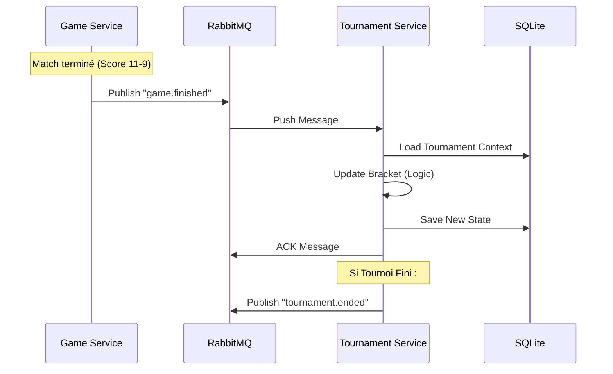

# Intégration Événementielle et RabbitMQ

### 1. Stratégie de Découplage et Prérequis

Le système repose sur une architecture événementielle pour isoler le cycle de vie du tournoi de la logique de jeu.

> **⚠️ IMPORTANT - Prérequis Techniques**
> L'intégration de cette couche dépend de la disponibilité des packages transverses de l'équipe "Common" :
> *   `@common/rabbitmq-client` : Pour l'abstraction Pub/Sub.
> *   `@common/vault-client` : Pour la récupération sécurisée des credentials AMQP.
> *   `@common/elk-client` : Pour le traçage distribué des événements.
>
> En attendant ces modules, le développement se fera avec des **Mocks locaux**.

*   **Pattern :** RabbitMQ en mode Pub/Sub (Topic Exchange).
*   **Rôle :**
    *   **Consommateur :** Écoute `game.finished` pour faire avancer l'arbre.
    *   **Producteur :** Émet `tournament.ended` pour l'historique et les succès.

### 2. Configuration de l'Infrastructure

*   **Exchange Global :** `transcendence.events` (Topic).
*   **Queue du Service :** `tournament.service.queue`.
*   **Routing Keys écoutées :**
    *   `game.finished` (Résultats de matchs).
    *   `user.updated` (Changement d'avatar/pseudo).
*   **Durabilité :** Queue durable (`durable: true`) pour ne perdre aucun résultat en cas de redémarrage du service Tournoi.

### 3. Événements Souscrits (Consommation)

#### 3.1 Résultat de Partie (`game.finished`)
C'est le "battement de cœur" qui fait avancer le tournoi.

*   **Source :** Game Service.
*   **Payload Contractuel :**
    ```typescript
    interface GameFinishedEvent {
      gameId: string;       // UUID de la partie
      tournamentId?: string;// UUID du tournoi (Absent si partie "Ladder")
      winnerId: string;     // UUID du joueur gagnant
      score: {
        p1: number;
        p2: number;
      };
      reason: 'score' | 'forfeit' | 'disconnect';
      endedAt: string;      // ISO Date
    }
    ```
*   **Logique de Traitement :**
    1.  Vérifier si `tournamentId` est présent (sinon `ACK` immédiat et ignore).
    2.  Charger l'arbre du tournoi.
    3.  Appliquer le résultat via `BracketService`.
    4.  Si tout est OK -> `ACK`.
    5.  Si erreur technique (DB down) -> `NACK` + Requeue.

### 4. Événements Publiés (Production)

#### 4.1 Fin de Tournoi (`tournament.ended`)
*   **Destinataires :** User Service (Stats), Achievement Service (Trophées).
*   **Routing Key :** `tournament.ended`.
*   **Payload Contractuel :**
    ```typescript
    interface TournamentEndedEvent {
      id: string;
      name: string;
      winner: { id: string; alias: string };
      rankings: Array<{
        userId: string;
        rank: number; // 1, 2, 3...
      }>;
      startedAt: string;
      endedAt: string;
    }
    ```

### 5. Diagramme de Séquence Asynchrone

