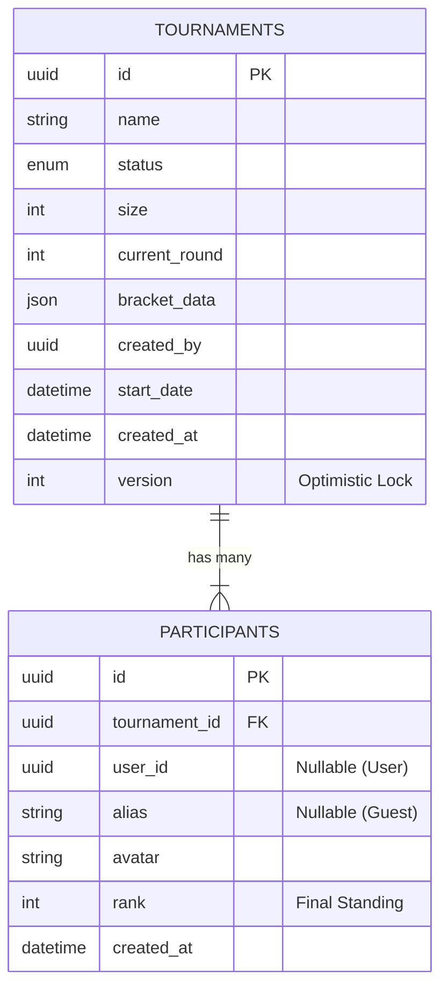

# Schémas de Données et Persistance (SQLite)

### 1. Stratégie de Persistance

Le modèle de données est conçu pour la **cohérence forte** (Strong Consistency) car un tournoi ne supporte pas les états partiels (ex: un match sans vainqueur alors que le suivant a commencé).

*   **Technologie :** SQLite (via `better-sqlite3`).
    *   *Choix :* Fichier local performant, support ACID complet, pas de latence réseau.

*   **Approche Hybride (Relationnel + Document) :**
    *   **Relationnel (`Tournaments`, `Participants`) :** Pour les métadonnées requérables (Statut, Date, Liste des joueurs). Permet des requêtes SQL classiques : `SELECT * FROM tournaments WHERE status = 'PENDING'`.
    *   **Document (`bracket_data` JSON) :** Pour l'état interne complexe.
    *   *Pourquoi JSON ?*
        1.  **Complexité :** Un arbre binaire est une structure récursive. Le mapper en SQL (Table `Matches` avec `parent_id`) impliquerait des jointures coûteuses ou des CTE récursives pour reconstruire l'arbre complet à chaque lecture.
        2.  **Atomicité :** En stockant tout l'arbre dans une seule colonne, on garantit qu'on charge/sauvegarde toujours un état valide et complet. Pas de risque de lire "la moitié" d'un tournoi.

*   **Pattern d'Accès (Repository) :**
    *   Lecture : `findById` charge la ligne et parse le JSON en objet TypeScript `TournamentBracket`.
    *   Écriture : Le Repository sérialise l'objet `TournamentBracket` en string JSON et met à jour la ligne dans une transaction.


### 2. Diagramme Entité-Relation (ERD)



### 3. Définition des Tables

Les types utilisés sont ceux de SQLite (`TEXT`, `INTEGER`, `REAL`, `BLOB`), mappés vers TypeScript.

#### 3.1 Table `tournaments`
Table maîtresse contenant la configuration, l'état global et l'arbre sérialisé.

| Colonne | Type SQL | Contraintes | Description |
| :--- | :--- | :--- | :--- |
| `id` | `TEXT` | PK, NOT NULL | UUID v4. |
| `name` | `TEXT` | NOT NULL | Nom du tournoi (Max 50 chars). |
| `status` | `TEXT` | NOT NULL | `PENDING`, `IN_PROGRESS`, `FINISHED`, `CANCELLED`. |
| `size` | `INTEGER` | NOT NULL | Capacité (4, 8, 16). |
| `current_round` | `INTEGER` | DEFAULT 1 | Numéro du round en cours. |
| `start_mode` | `TEXT` | NOT NULL | `MANUAL`, `AUTO_FULL`, `AUTO_TIMER`. |
| `start_date` | `TEXT` | NULLABLE | ISO8601 Date. Requis si `AUTO_TIMER`. |
| `bracket_data` | `TEXT` | NOT NULL | **JSON Payload**. L'arbre complet. |
| `created_by` | `TEXT` | NULLABLE | UUID de l'user créateur (NULL si guest). |
| `admin_secret` | `TEXT` | NULLABLE | Token secret pour l'admin invité. |
| `version` | `INTEGER` | DEFAULT 0 | Compteur pour **Optimistic Locking**. |
| `created_at` | `TEXT` | DEFAULT NOW | Timestamp ISO. |
| `updated_at` | `TEXT` | DEFAULT NOW | Timestamp ISO. |

#### 3.2 Table `participants`
Vue à plat des joueurs. Permet les jointures et l'analytique sans parser le JSON.

| Colonne | Type SQL | Contraintes | Description |
| :--- | :--- | :--- | :--- |
| `id` | `TEXT` | PK, NOT NULL | UUID v4 de l'inscription. |
| `tournament_id` | `TEXT` | FK, NOT NULL | Réf `tournaments(id)` ON DELETE CASCADE. |
| `user_id` | `TEXT` | NULLABLE | UUID du User Service (si authentifié). |
| `alias` | `TEXT` | NOT NULL | Nom affiché (copie du profil ou saisi). |
| `avatar` | `TEXT` | NULLABLE | URL de l'avatar (snapshot). |
| `rank` | `INTEGER` | NULLABLE | 1=Winner, 2=Finalist... (NULL = en course). |
| `created_at` | `TEXT` | DEFAULT NOW | Date d'inscription. |

> **Index Performance :**
> *   `CREATE INDEX idx_participants_tournament ON participants(tournament_id);`
> *   `CREATE INDEX idx_participants_user ON participants(user_id);`

### 4. Structure JSON du `bracket_data`

Détail technique de l'objet stocké. Il doit permettre de reconstruire l'état complet du tournoi en mémoire.

*   **Format :** Liste plate de matchs (`matches`) + Métadonnées de Rounds.
*   **Navigation :** Chaque match pointe vers son successeur via `nextMatchId`.
*   **Exemple de Payload (Tournoi 4 Joueurs, Round 1 fini) :**

```json
{
  "currentRound": 2,
  "totalRounds": 2,
  "matches": [
    // --- ROUND 1 ---
    {
      "id": "m_1",
      "round": 1,
      "status": "COMPLETED",
      "player1Id": "u_neo",
      "player2Id": "u_trinity",
      "winnerId": "u_neo",
      "score": [11, 9],
      "nextMatchId": "m_3", // Le vainqueur ira en m_3
      "gameId": "ext_game_001",
      "startTime": "2024-05-20T10:00:00Z",
      "endTime": "2024-05-20T10:05:00Z"
    },
    {
      "id": "m_2",
      "round": 1,
      "status": "COMPLETED",
      "player1Id": "u_morpheus",
      "player2Id": "u_smith",
      "winnerId": "u_smith",
      "score": [8, 11],
      "nextMatchId": "m_3",
      "gameId": "ext_game_002"
    },
    // --- ROUND 2 (Finale) ---
    {
      "id": "m_3",
      "round": 2,
      "status": "IN_PROGRESS",
      "player1Id": "u_neo",    // Vient de m_1
      "player2Id": "u_smith",  // Vient de m_2
      "winnerId": null,
      "score": [0, 0],
      "nextMatchId": null,     // Racine de l'arbre
      "gameId": "ext_game_003",
      "startTime": "2024-05-20T10:15:00Z"
    }
  ]
}
```


### 5. Gestion des Transactions et Concurrence

Puisque tout l'arbre est stocké dans une seule cellule JSON, une modification concurrente (ex: deux matchs finissent à la même milliseconde) pourrait entraîner une perte de données (Lost Update).

#### Stratégie : Optimistic Locking avec Retry

1.  **Lecture (Load) :**
    *   Le service charge le tournoi : `SELECT id, bracket_data, version FROM tournaments WHERE id = ?`.
    *   On récupère `version: 42`.

2.  **Modification (In-Memory) :**
    *   Le `BracketService` applique le résultat du match A.
    *   L'arbre est mis à jour en mémoire.

3.  **Sauvegarde Atomique (CAS - Compare And Swap) :**
    *   On tente la mise à jour conditionnelle :
        ```sql
        UPDATE tournaments 
        SET bracket_data = :newData, version = version + 1 
        WHERE id = :id AND version = :currentVersion
        ```
    *   Ici `:currentVersion` vaut 42.

4.  **Résultat :**
    *   **Succès (Rows affected = 1) :** La version passe à 43. Transaction committée.
    *   **Échec (Rows affected = 0) :** Cela signifie que quelqu'un d'autre a passé la version à 43 entre temps.
        *   **Action :** `Rollback`, attente aléatoire (Jitter 50-200ms), puis **retour à l'étape 1** (recharger le nouvel état 43 et réappliquer la logique).

> **Pourquoi pas Pessimistic Locking (`SELECT ... FOR UPDATE`) ?**
> SQLite gère mal le verrouillage explicite de lignes en mode WAL. L'approche optimiste est plus performante et sans deadlock pour notre cas d'usage (faible probabilité de collision réelle).


### 6. Initialisation du Schéma (Bootstrapping)

Le service utilise un plugin Fastify personnalisé (`sqlite-plugin.ts`) pour garantir que la base de données est prête avant d'accepter des requêtes.

*   **Mécanisme :**
    1.  Au démarrage, le plugin vérifie l'existence du fichier DB.
    2.  Il lit le fichier `data/init.sql`.
    3.  Il exécute le script SQL (création des tables `IF NOT EXISTS`).
*   **Avantage :** Simple, pas de dépendance lourde vers un ORM ou un outil de migration CLI complexe pour ce microservice autonome.
