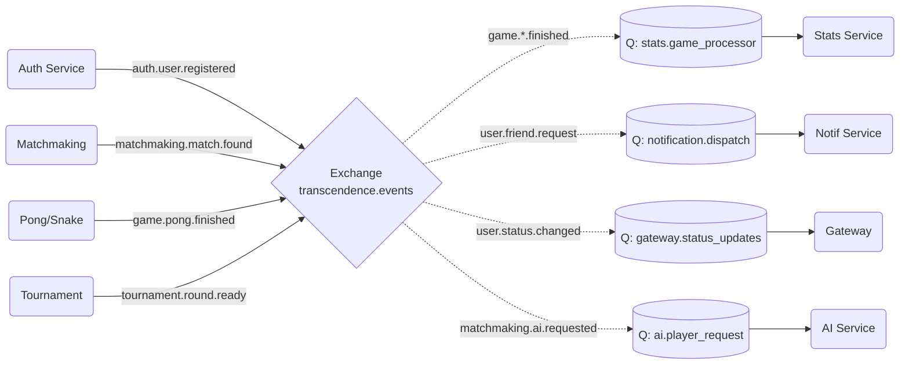

# Architecture Événementielle (RabbitMQ)

## 1. Vue d'ensemble
Ce document définit le contrat d'interface pour la communication asynchrone entre les microservices du projet `ft_transcendence`.
L'architecture repose sur le pattern **Publish/Subscribe** via RabbitMQ.

### Configuration Globale
* **Exchange Principal :** `transcendence.events`
* **Type d'Exchange :** `topic`
* **Format des Messages :** JSON (UTF-8)

---

## 2. Stratégie de Routage (Routing Keys)

Les clés de routage suivent la hiérarchie suivante :
`domain.entity.action`

### A. Domaine : Utilisateurs & Auth (`user.*`, `auth.*`)
*Émetteurs : Service Auth, Service User*

| Routing Key | Payload (Données) | Description |
| :--- | :--- | :--- |
| `auth.user.registered` | `{ "userId": "uuid", "email": "...", "provider": "github" }` | Un nouvel utilisateur s'est inscrit. Déclenche la création du profil public et des stats. |
| `user.profile.updated` | `{ "userId": "uuid", "avatar": "url", "name": "new_alias" }` | Un utilisateur a modifié son profil. |
| `user.status.changed` | `{ "userId": "uuid", "status": "online|offline|ingame" }` | Changement d'état de connexion (pour la liste d'amis). |
| `user.friend.request` | `{ "from": "uuid", "to": "uuid" }` | Demande d'ami envoyée. |

### B. Domaine : Matchmaking (`matchmaking.*`)
*Émetteur : Service Matchmaking*

| Routing Key | Payload (Données) | Description |
| :--- | :--- | :--- |
| `matchmaking.match.found` | `{ "matchId": "uuid", "p1": "uuid", "p2": "uuid", "mode": "pong" }` | Un match est prêt. Les services de jeu doivent instancier la partie. |
| `matchmaking.ai.requested` | `{ "userId": "uuid", "difficulty": "easy|hard", "mode": "pong" }` | Un joueur demande à jouer contre le bot. |

### C. Domaine : Jeu (`game.*`)
*Émetteurs : Service Pong, Service Snake*
*(Note : La position de la balle/serpent temps réel passe par WebSocket, pas par RabbitMQ)*

| Routing Key | Payload (Données) | Description |
| :--- | :--- | :--- |
| `game.pong.started` | `{ "matchId": "uuid", "players": ["uuid", "uuid"] }` | La partie commence. Le statut des joueurs passe à `ingame`. |
| `game.pong.finished` | `{ "matchId": "uuid", "winner": "uuid", "score": "10-5" }` | Fin de partie normale. Enregistrement des scores et MMR. |
| `game.pong.aborted` | `{ "matchId": "uuid", "reason": "disconnect" }` | Partie annulée (rage quit). |
| `game.snake.finished` | `{ "matchId": "uuid", "score": 1500 }` | Fin de partie solo (Snake). |

### D. Domaine : Tournoi (`tournament.*`)
*Émetteur : Service Tournament*

| Routing Key | Payload (Données) | Description |
| :--- | :--- | :--- |
| `tournament.round.ready` | `{ "tournamentId": "uuid", "matches": [...] }` | Une nouvelle ronde de tournoi est prête. Envoi au matchmaking. |

---

## 3. Configuration des Consommateurs (Queues)

Chaque microservice déclare sa propre file d'attente et définit quels messages l'intéressent (Binding).

| Service Consommateur | Nom de la Queue | Bindings (Ce qu'il écoute) | Action |
| :--- | :--- | :--- | :--- |
| **Stats Service** | `stats.game_processor` | `game.*.finished` `game.*.aborted` | Calcul du MMR, Elo, XP et historisation. |
| **Notification Service** | `notification.dispatch` | `user.friend.request` `tournament.round.ready` `matchmaking.match.found` | Envoi de notifications WebSocket ("Toast") aux clients. |
| **Gateway / Frontend** | `gateway.status_updates` | `user.status.changed` | Mise à jour temps réel des listes d'amis connectés. |
| **AI Service** | `ai.player_request` | `matchmaking.ai.requested` | Provisionning d'une instance de bot. |
| **User Service** | `user.auth_sync` | `auth.user.registered` `game.*.started` `game.*.finished` | Init profil user / Gestion statut "ingame". |

---

## 4. Flux de Données (Diagramme)

